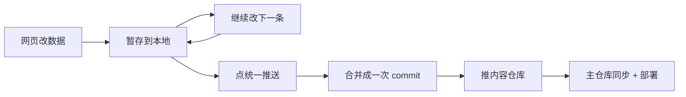

# 给博客加了在线编辑器，改内容再也不用开编辑器了

之前每次想改点数据——比如给追番列表加一部、友链换张图、公告改句话——都得本地开编辑器、改 `data/*.ts`、commit、push，再等部署。步骤不少，手机上还搞不了。于是我给博客加了个**浏览器里的在线编辑器**，现在直接在网页上点几下就能改。

> 入口在 `/admin/<页面名>-edit`，比如追番是 `/admin/anime-edit`，友链是 `/admin/friends-edit`。从站点导航栏的 logo 进去就能看到入口。

## 它能干啥

不是只支持一种数据，而是**按 schema 自动生成表单**：文章、友链、网站导航、时间线、日记、追番、公告、设备、足迹、关于页、相册……每种数据类型一份 schema，编辑器读 schema 自动画出对应的字段表单。

:::tip
字段类型挺全的：`string` 文本框、`text` 多行、`number` 数字、`select` 下拉、`tags` 标签、`boolean` 开关、`date` 日期，甚至 `object-list` 嵌套列表。加新数据类型基本就是写一份 schema，不用动前端。
:::

## 暂存 + 统一推送

早期版本我做成「改一条就立刻推一条」，后来觉得太碎——改五条就五个提交、五次部署，没必要。所以改成了**暂存 + 统一推送**：

1. 你改的每条数据先**暂存**到浏览器内存（顶部「统一推送(N)」按钮会显示待推送数量）；
2. 确认无误后点一下「统一推送」，把所有改动**合并成一次提交**推到内容仓库；
3. 一次提交触发一次部署，约 1–3 分钟生效。

## 背后怎么实现的

核心思路是「**纯 GitHub API，不碰服务器**」：

- 读数据走 **Contents API**（`GET /repos/.../contents/...`），把 `data/*.ts` 拉下来解析；
- 写数据走 **Git Data API**（`commitTree`）：建 blob → 建 tree → 建 commit → 更新分支引用，一次提交塞下所有改动；
- 编辑器代码本身是站点仓库 `public/js/editor/` 下的一堆 JS（`app.v2.js`、`github.js`、`schema.js`……），用 `<script>` 直接挂到 `/admin` 页面上。

> 为什么叫 `app.v2.js` 而不是 `app.js`？因为浏览器会缓存旧 JS。改名相当于「缓存炸弹」，强制访客重新下载最新版，省得你改了逻辑用户还在跑老代码。

## 上线时踩的一个 GitHub API 坑

批量推送那一步，更新分支引用要用 **PATCH `/git/refs/heads/{分支}`**（复数 `refs`）。我一开始图省事，复用了读取时用的 `GET /git/ref/heads/{分支}`（单数 `ref`）来拼 PATCH 的 URL——结果 GET 能成功、PATCH 直接 404 `Not Found (ref-update)`。查了文档才反应过来：**取单个引用是单数 `ref`，更新引用必须是复数 `refs`**，两个端点不一样。改完一行就好了。

:::caution
如果你也用 Git Data API 批量提交，记得 PATCH ref 用复数 `/git/refs/`。这个坑不踩一次真的想不起来。
:::

## 关于这篇

:::note
这篇博客和上面这个在线编辑器，从需求到代码**全程都是 AI 写的**（我只需要说「我要什么」）。所以行文如果有点「机器味」请见谅，功能本身实测可用。有更顺手的改法也欢迎来告诉我。
:::

## 小结

- 在线编辑器 = 按 schema 生成表单 + 浏览器里直接改；
- 改完先暂存、再统一推送，合并成一次提交触发部署；
- 纯 GitHub API 实现，零后端；
- 顺手修了一个 `/git/ref` 与 `/git/refs` 的单复数坑。

路过的如果想改自己博客，思路可以照搬；想偷懒的话，这个编辑器本来就是 AI 生成的，问 AI 要一份就行。
