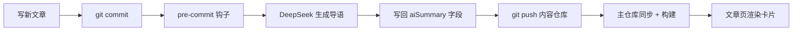

访客点进一篇文章之前，其实最想知道的是「这篇到底讲啥」。之前得自己扫正文才能判断，挺费劲。于是我在每篇文章顶部加了一张 AI 摘要卡片——访客一眼扫过去就知道这篇值不值得读。

> 它和首页那个 `description` 不是一回事。首页 `description` 是给列表页看的简短一句；AI 摘要是文章内部的人性化导语，更像博主本人在跟你打招呼。

## 它长什么样

文章标题下面、封面上面，一张小卡片：左边是 DeepSeek 的蓝色文字标，右边「AI 摘要」四个字，下面是约 50 字的第一人称导语，带着打字机动画一个字一个字蹦出来。

:::tip
动画会尊重系统的「减少动态效果」设置；页面用 Swup 切换时也会重新触发，不会卡住不动。
:::

## 怎么实现的

核心思路是「构建时生成、运行时零 API 调用」：

1. 一篇新文章写完后，DeepSeek 根据正文生成一段 50 字以内的导语；
2. 结果写回文章 frontmatter 的 `aiSummary` 字段（和 `description` 完全分开，互不干扰）；
3. 文章页渲染 `AiSummary.astro` 组件，读 `aiSummary` 字段做打字机呈现。

## 写新文章时怎么自动补

我在内容仓库装了一个 git pre-commit 钩子，直接复用看板娘那套 DeepSeek 配置（`DEEPSEEK_API_KEY`）。只要文章还没有 `aiSummary`，提交时就会自动生成并一起提交——你平时还是只做 `git add -A` → `commit` → `push` 这三步，摘要自己就带上了。

:::caution
钩子是非阻塞的：万一没配 key、或者网络挂了，它只会打印警告、不会拦你提交。所以首次部署前记得在 `Mizuki-master/.env` 里放好 `DEEPSEEK_API_KEY`。
:::

## 几个踩过的坑

- **图标**：DeepSeek 在 `@iconify-json/logos` 里其实是个宽幅文字标，被我一开始的正方形 CSS 压成方块后根本看不见。最后直接把 SVG 内联进组件，彻底绕开 astro-icon 的白名单坑（之前 `auto_awesome` 找不到图标也是它闹的）。
- **字段分离**：`aiSummary` 和 `description` 一定要分开存。最开始我俩混用同一个字段，结果首页描述和文章摘要互相串味，访客在列表看到的是文章内部的导语，乱套了。

## 小结

- AI 摘要卡片 = DeepSeek 生成 + 打字机动画 + 提交时自动补；
- `aiSummary` 独立于首页 `description`，各管各的；
- 写新文章不用管摘要，钩子会帮你搞定。

> 想看实际效果，随便点开一篇旧文章就行——现在它们都已经带摘要了。

