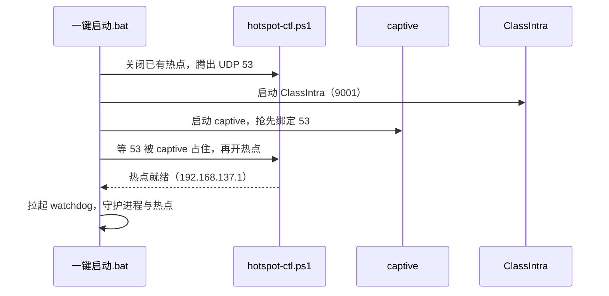

最近班里多了个东西。

教室电脑上双击一个 bat，开出一个热点，同学平板连上去，本来该跳出畅言智慧课堂的，结果进了我们自己搭的小站。

不是老师弄的 —— **是班管（也是学生）趁自习课前把服务起来**，剩下的时间大家连上热点自己玩。老师那边看到的还是电脑上那个热点，我们在里面干嘛他也不知道。

[ClassIntra](https://github.com/ClassIntra/ClassIntra) 是个开源的校园内网 WebOS 平台。但它官方的部署方式对学生来说太劝退了：要装 Node、配依赖、敲命令、还得盯着进程别挂。教室电脑上更不现实——那台机器不一定让你装东西。

所以我做的事情是：把它**连同运行环境一起打包成一个绿色便携版**，再配一套热点劫持组件，最后收敛成一条路径——**解压，双击一个 bat，完事**。

::github{repo="yujing0208/classintra-portable"}

:::tip
只想看怎么用的话，直接跳到「怎么用」那一节。原理部分从下面开始。
:::

## 先说清楚它干了什么

场景是这样的：教室电脑上开一个 WiFi 热点，大家平板连上去，然后访问 `spark.changyan.com`（畅言智慧课堂）、`ai.changyan.com`、`zhixue.com`（智学网）这类平台的域名时，**请求不会出公网，而是直接被导到这台电脑自己跑的服务上**。

也就是说，**畅言被跳过去了**。

平板打开这些网址，出来的不是老师的课堂，是我们自己的平台。不需要装任何客户端，不需要手动改 DNS，连上热点就行。

要做到这个效果，靠的是三件事叠在一起：**DNS 劫持 + HTTPS 反向代理 + 自签证书**。

拆开看就是两个服务：

- **DNS 服务器（UDP 53）**：看到配置里那几个域名，就撒谎说"它的 IP 是 `192.168.137.1`"（也就是这台电脑在热点网段里的地址）；别的域名老老实实转发给上游，该上网的还是能上网。
- **HTTPS 反向代理（TCP 443）**：平板的请求打到 443 上，用一张自签证书把 TLS 拆开，转成明文 HTTP 发给本机 9001 端口——ClassIntra 就在那儿。

:::note
拦截的域名写在 `captive/hotspot-redirect.js` 的 `interceptDomains` 里，子域名会自动匹配。想加别的域名（比如某个作业网站），往数组里塞一行就行。
:::

之所以不用改 hosts 或者改路由器 DNS，是因为**同学设备那边必须零配置**。平板是我们管不了的，能控制的只有自己手上这台电脑。

## 里面能玩什么

这才是重点。进去之后是个完整的桌面系统，能玩的东西挺多：

| 玩什么 | 对应应用 | 说明 |
| --- | --- | --- |
| 群聊 | `chat` | 全班一个聊天室，跟班级群差不多，但能在平板上直接开 |
| 发帖 | `community` | 社区版块，发帖、评论、点赞，有点像班里自己的小贴吧 |
| 听歌 | `music` | 内置音乐播放器，歌单可以自己往里放 |
| 看片 | `resource` | 资源库/网盘，传上来的视频、图片、文件都能直接在班里共享 |
| 小游戏 | `market` + HTML | 包里带了 `starfall-survivors.html` 这种单文件网页游戏，应用市场里也能装别的 |
| 内置 AI | `ai-chat` | 直接就是一个 AI 对话助手，填个 API key 就能用 |
| 其他 | `notes` / `calendar` / `countdown` / `timetable` / `weather` | 便签墙、日历、倒计时、课表、天气、计算器 |

**「传丑照」这块是重灾区。** 资源库就是个班里内部的小网盘，谁拍了谁的照片往上一丢，全班都能看。我见过最快的传播速度就是从这个功能开始的。

AI 那个是内置的，配好之后在平板上直接聊，不用翻墙不用装 App。

:::important
说清楚一点：**这玩意儿的正经用法是自习课、午休、课间**。正课时间是该关掉的——开热点会占着教室电脑，而且真被老师发现你平板在聊天室里刷屏，那就不是技术问题了。
:::

## 包里都装了什么

整个交付包解压出来大概长这样：

| 目录 | 内容 |
| --- | --- |
| `runtime/` | 内嵌的 Node 运行时（含一个无窗口版和一个带控制台的） |
| `server/` | ClassIntra 后端，跑在 9001 |
| `client/` | 前端打包产物，后端直接托管 |
| `captive/` | 热点劫持服务（DNS 53 + HTTPS 443） |
| `Resources/` | 课表、图标、壁纸、媒体、小游戏等数据 |
| `logs/` | 运行日志 |
| `一键启动.bat` | 唯一的启动入口 |

关键点是 `runtime/`——Node 环境是**跟着包走的**，解压就能跑。目标电脑上不需要装 Node，不需要联网装依赖，也不会污染系统。**装在 U 盘里拷来拷去也行。**

:::important
因为要绑定 53 和 443 端口，启动脚本会自动请求管理员权限。UAC 弹窗点「是」就行。
:::

## 双击之后发生了什么

这就是整个项目最有意思的部分了。启动脚本的执行顺序不是随便排的，中间踩了一个挺深的坑。

顺序是这样的：

**为什么热点要放在最后开？** 这一点我卡了很久。

Windows 那个「移动热点」其实是靠 ICS（Internet 连接共享）撑起来的。热点开着的时候，ICS 会把自己的 DNS 代理绑到 `0.0.0.0:53` 上——**正好就是 captive 要用的那个端口**。于是：

- 先开热点 → ICS 占着 53 → captive 绑不上 → 劫持直接失效
- 想停掉 ICS 把 53 腾出来 → Windows 一停 ICS 就顺手把热点关了

死循环。

最后的解法是反过来：**让 captive 先绑住 53，再去开热点**。这时候 ICS 抢不到 53，但热点本身照样能正常起来。顺序换一下，问题就没了。

另外热点本身准备了两条路，按顺序尝试：

1. **`netsh wlan hostednetwork`** —— 不走 ICS，连接数上限能到 100 台，而且 SYSTEM 会话下也能跑。首选。
2. **Windows 移动热点（WinRT API）** —— 兜底方案。但它需要有人登录着桌面，而且大约只支持 8 台设备。

第一条失败了会自动退到第二条，日志在 `logs/hotspot.log` 里。

## 让它自己活着

教室电脑平时没人管，服务挂了也不会有人去重启。所以包了一个 `watchdog.ps1`，每 20 秒轮询一次：

- **ClassIntra 还活着吗**——同时看「有没有 `src\app.js` 进程」和「9001 端口在不在监听」，两个都不成立才算挂
- **热点还在吗**——看 `192.168.137.1` 这个地址还在不在
- 挂了就拉起来，但带 **45 秒启动宽限**和 **60 秒重启冷却**，避免冷启动时误判、以及无脑重启风暴
- 启动它的那个窗口被关掉时，它也自己退出，不留后台孤儿进程

日志在 `logs/watchdog.log`。

## 怎么用

### 班管这边

1. 把整个文件夹解压到任意目录（路径别太深就行）
2. 双击 **`一键启动.bat`**，UAC 弹窗点「是」
3. 等窗口里提示 ClassIntra 和 Captive 都起来了
4. 开热点，SSID 是**电脑名**，默认密码 `classintr`

### 同学这边

连上热点，浏览器随便打开一个被劫持的域名（比如 `spark.changyan.com`），证书警告点「继续访问」就进去了。

:::warning
「证书不受信任」的警告是**正常的**，因为用的是自签证书，不是网站的正式证书。点「继续访问 / 高级 → 继续前往」即可。
:::

第一次注册要按学号规则来，班管在后台把名单导进去之后，同学直接注册登录就行。

### 想让它开机自动启动

跑一次 **`设置开机自启.bat`**，会建一个开机触发的计划任务。之后电脑开机、不用登录，服务就自己起来了——不用每次都等班管手动开。

### 想改课表

改 `Resources\public\kb.yml` 就行，UTF-8 保存，刷新页面立刻生效，不用重启服务。

## 顺手做的几个小东西

打包过程中也顺手解决了一些别的问题：

- **启动脚本合并**：原本要按顺序点好几个 bat（先启动服务、再启动劫持），现在合成一个 `一键启动.bat`，自动提权、跑在同一个窗口里。
- **数据搬家**：整个 `server\database\` + `Resources\` + `server\.env` 拷到新机器就能把数据带走（聊天记录、帖子、传的照片都在里面）。注意 SQLite 是 WAL 模式，**必须停掉服务再拷**，而且 `.db` / `.db-wal` / `.db-shm` 三个要一起拷。
- **跨班联动**：多台 ClassIntra 可以通过中继互相同步公共消息——几个班可以串成一个更大的局域网。但要注意它是**全互联**结构，代码不会把消息转发给第三方，所以有多少个班，每台就得配「除自己以外」的全部地址，且都得在同一个能互访的网络里。

## 踩过的坑，挑几个说

真正耗时间的其实不是功能，是这些：

**bat 的编码和换行。** 中文 Windows 的 cmd 认的是 GBK，脚本存成 UTF-8 会满屏乱码；而且 `.bat` 必须是 CRLF 换行，纯 LF 会被 cmd 当成一整行，报出一堆莫名其妙的「不是内部或外部命令」。这两个坑加起来能让人怀疑人生。

**`start /B` 的参数解析。** 用 `start /B "带引号的路径" 参数` 时，第一个带引号的参数会被当成**窗口标题**而不是程序路径。必须先塞一个空标题：`start /B "" "程序" 参数`。

**课表时段的分界。** 课表页是按开始时间自动分「早读 / 上午 / 下午」的。原来早读和上午的分界写的是 08:00，结果周一第一节 07:50 开始，被判定成了早读，整张表错位一行。分界改成 07:45 才对。

这些坑没什么技术含量，但不踩一遍根本想不到。

## 小结

这个项目的核心其实就一句话：**把一套需要折腾的东西，压缩成双击一次**。

技术本身不复杂——DNS 劫持、反向代理、进程守护都是很成熟的做法。麻烦的地方在于 Windows 那一堆平台特性：ICS 抢端口、热点两种实现的能力差异、计划任务的会话限制、cmd 的编码和换行。这些没有文档，只能一个个试出来。

现在它跑得挺稳的。自习课开一次，全班连上来，聊天室基本没停过。

仓库在下面，有兴趣可以看看，代码不算漂亮但注释写得挺细。

::github{repo="ClassIntra/ClassIntra"}

## 参考

- [ClassIntra 官方仓库](https://github.com/ClassIntra/ClassIntra) —— 校园内网 WebOS 平台本体
- [ClassIntra 官方文档](https://classintra.github.io) —— 部署与使用指南
- [本项目仓库](https://github.com/yujing0208/classintra-portable) —— 绿色便携版与热点劫持组件

