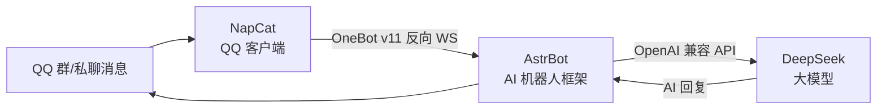

之前一直想要一个 24 小时在线的 QQ 机器人，能聊天、能整活、最好还不用花钱。折腾了一圈，最后用 **NapCat + AstrBot + DeepSeek** 这套组合在腾讯云轻量服务器上把它跑通了。这篇把完整方案和踩过的坑都记录下来，给想自己搭一个的人当参考。

:::tip
如果你只想要结论：轻量服务器免费试用一个月 → Docker 跑 NapCat + AstrBot 两个容器 → 扫码登录 → 接 DeepSeek。坑我都替你踩完了，照着走就行。
:::

## 这套方案长什么样

先看整体架构：



三个组件各司其职：

- **NapCat**：伪装成 QQ NT 客户端登录 QQ，把消息转成标准的 OneBot 协议。相当于机器人的「手和眼」。
- **AstrBot**：AI 机器人框架，负责接收消息、调用大模型、管理插件。相当于机器人的「大脑调度中心」。
- **DeepSeek**：便宜好用的大模型，负责真正生成回复内容。

为什么选这个组合，主要是这几条：

| 维度 | 说明 |
|---|---|
| 国内 IP | 腾讯云轻量服务器，QQ 登录基本不会被风控 |
| 24h 在线 | 服务器上跑 Docker，不依赖电脑或手机挂着 |
| 成本 | 免费试用 1 个月，之后一年也就几十块 |
| 可扩展 | AstrBot 插件市场有 1900+ 插件，随时加功能 |

:::note
这套方案最大的优势就是**省心**：服务器 7×24 小时在线，Docker 容器崩了 restart 就能拉起来，手机 QQ 扫码一次之后登录态会持久化，重启不用重新扫码。
:::

## 服务器准备

腾讯云官网 → 轻量应用服务器 → 选 2核2G → 国内地域 → Ubuntu 系统 → 0 元下单（新用户免费试用 1 个月）。

拿到服务器后，第一件事是放行防火墙端口。控制台 → 实例 → 防火墙 → 添加 3 条 TCP 规则（来源 0.0.0.0/0）：

| 端口 | 用途 |
|---|---|
| 6099 | NapCat WebUI（扫码登录用） |
| 6185 | AstrBot 管理面板 |
| 6199 | OneBot 反向 WS（NapCat ↔ AstrBot 互联） |

Docker 环境镜像自带，只需要额外配置一下腾讯云内网加速器 `mirror.ccs.tencentyun.com`，后面拉镜像会快很多。

## 部署步骤

### 启动容器

把 `docker-compose.yml` 传到服务器（NapCat + AstrBot 两个容器），然后启动。

:::warning 这里有个大坑
NapCat 官方镜像在 `ghcr.io/napneko/napcat-docker`，**国内服务器直接拉会报 denied（被墙）**。换成 `mlikiowa/napcat-docker:latest`，走 Docker Hub + 腾讯云加速器就没问题。
:::

### NapCat 扫码登录

1. 浏览器访问 `http://<服务器IP>:6099/webui?token=<WEBUI_TOKEN>`（带 token 的完整链接，别手动输）
2. WebUI 里弹出二维码 → 手机 QQ 扫码确认
3. 登录态持久化在容器卷里，之后重启不用重新扫

:::warning 扫码报 ErrCode 3？
`docker restart napcat` 重新生成二维码再试。如果多次失败，大概率是这个 QQ 号被风控了，换个活跃的小号。
:::

### AstrBot 初始化 + 互联

1. 打开面板 `http://<服务器IP>:6185`，登录后先改默认密码
2. AstrBot 侧：机器人 → OneBot v11 → 反向 WS 主机 `0.0.0.0`、端口 `6199`，Token 自己设一个
3. NapCat 侧：网络配置 → 新建 WebSocket 客户端 → `ws://astrbot:6199/ws`，填**一模一样的 Token**

:::important
两端的 Token 必须完全一致，而且 URL 要用容器名 `astrbot` 而不是 IP——因为在同一个 Docker 网络里，容器名就是主机名。
:::

验证是否连通：看 AstrBot 平台日志，出现「aiocqhttp(OneBot v11) 适配器已连接」就说明握手成功了。

### 接 DeepSeek

模型提供商 → 选 DeepSeek → 填 API Key 和 Base URL `https://api.deepseek.com/v1` → 默认模型设成 `deepseek-v4-flash`。完事。

## 踩坑记录

整个流程最耗时间的不是部署，是排坑。列个清单，遇到问题直接对号入座：

| # | 坑 | 解决 |
|---|---|---|
| 1 | `ghcr.io` 拉镜像 denied | 换 `mlikiowa/napcat-docker:latest` + 腾讯云加速器 |
| 2 | NapCat 扫码 `ErrCode 3` | `docker restart napcat` 重出二维码；换个活跃 QQ 小号 |
| 3 | NapCat WebUI Token 无效 | 直接用带 token 的完整链接，不要手动输 |
| 4 | WS 连不上 | 两端 Token 必须完全一致；URL 用容器名 `ws://astrbot:6199/ws` |
| 5 | 机器人不回复 | AstrBot 白名单开了但名单是空的 → 关掉白名单或把自己的 QQ 号加进去 |
| 6 | 远程命令超长 AccessDeny | 拆成短命令执行；文件传输用 base64 编码 |
| 7 | 面板初始密码失效 | 在面板里重新设置过密码，用自己改过的那个 |

第 5 条最坑：AstrBot 默认开着 `enable_id_white_list` 但名单为空，结果就是**机器人对谁都不回话**，排查半天才发现是白名单的问题。

## 日常运维

几个常用命令：

```bash
docker logs napcat        # 看 NapCat 日志
docker logs astrbot       # 看 AstrBot 日志
docker restart napcat     # 重启 NapCat
docker restart astrbot    # 重启 AstrBot
docker compose down       # 停止全部
docker compose pull && docker compose up -d   # 升级
```

## 一个月免费期到了怎么办

试用到期前 3 天腾讯云会发短信提醒，提前想好续命方案（三选一）：

1. **续费**（一年几十块的 4核4G 首单秒杀）→ 最省心，国内 IP 基本零风控 ✅ 推荐
2. **迁 HuggingFace**（0 元长期，但是海外 IP）→ 得找个养得住的 QQ 小号扛风控
3. **自家旧手机挂着**（0 元，国内 IP）→ NapCat 安卓版 + 电脑跑 AstrBot

## 还能玩出什么花

跑通只是开始，AstrBot 的扩展空间挺大的：

- **插件市场**：知识库、天气、表情包、定时任务，一键安装
- **多平台**：AstrBot 支持同时接多个平台，QQ、微信、Telegram 可以共用一个大脑
- **知识库**：内置 knowledge_base，可以做成只属于你自己的专属问答机器人
- **人格化**：给模型加系统提示词，调教出一个有性格的机器人

我接下来的计划是加情绪化人格、定时早安/新闻推送，还有群管理功能，到时候再更新。

## 小结

这套方案的完整链路就是：**轻量服务器 → Docker 跑 NapCat + AstrBot → 接 DeepSeek**。核心成本几乎为零（试用期 0 元，续费一年也就几十块），24 小时在线不用管，QQ 登录也稳。

如果看完也想搭一个，照着上面的步骤来就行，坑我都替你踩过了。有问题欢迎在评论区聊。

## 参考

- [NapCat](https://napneko.github.io/) —— QQ 协议客户端，把 QQ 变成标准 OneBot 服务
- [AstrBot](https://github.com/Soulter/AstrBot) —— AI 机器人框架，插件市场 1900+ 插件
- [DeepSeek 开放平台](https://platform.deepseek.com/) —— 便宜好用的大模型 API
