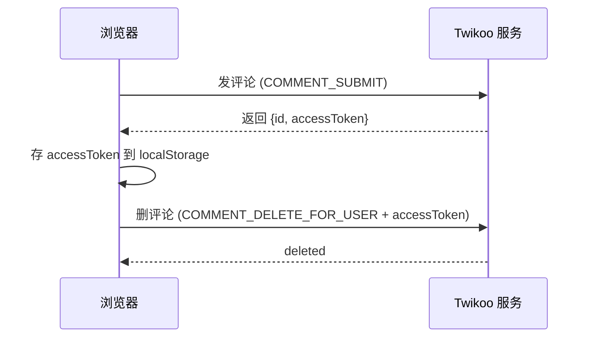

# 给博客塞了个 QQ 群聊风格的留言板

## 怎么想到搞这个的

有天逛别人的博客，发现右下角有个气泡按钮，点开是个**QQ 群聊风格的留言板**——消息一条条冒出来，还有气泡、头像、昵称，跟群聊一样热闹。对比自己博客那个规规矩矩的评论区，一下就馋了。

我的博客用的是 Twikoo 评论系统，其实 Twikoo 本身没有这种聊天式的 UI。想要这种效果，就得自己写。于是我决定：**评论数据还是用 Twikoo 存，界面全部自己画**。

> 说人话：Twikoo 相当于一个免费的后端（存评论、管审核），前端长什么样完全自己说了算。

---

## 第一步：搞懂 Twikoo 的接口

Twikoo 官方有个 SDK，但它是整个 UI 一起绑定的，没法只借接口。好在 Twikoo 支持「URL 模式」——就是直接往 `https://你的twikoo域名` 发 POST 请求，动作都写在 `event` 字段里。

我用脚本实测了一遍，把关键动作摸清楚了：

| 动作 | 作用 | 关键参数 |
| --- | --- | --- |
| `COMMENT_GET` | 拉评论列表 | `url`（频道）、`page`、`pageSize` |
| `COMMENT_SUBMIT` | 发评论 | `nick`、`mail`、`comment`、`url` |
| `COMMENT_DELETE_FOR_USER` | 删自己的评论 | `url`、`id` |
| `COMMENT_LIKE` | 点赞 | `url`、`commentId`、`like` |

响应里会带一个 `accessToken`，这是服务端给你的「访客会话令牌」，**必须存起来**，删评论的时候要靠它证明"这条是我发的"。整个流程就是：



:::tip
游客发评论不需要注册登录，Twikoo 会基于浏览器会话自动判定"这条评论是不是你发的"。所以留言板里每个人只能删自己发的，别人的消息压根不显示删除按钮。
:::

---

## 第二步：照着别人的 UI 抄

好看的留言板我选了个参考站，它的气泡组件做得特别完整：QQ 气泡、头像、站长徽章、引用回复、日期分隔、骨架屏，还有输入框的游客资料弹窗。

做法就是把它的 Svelte 组件和 CSS 拿下来，**数据层整个换掉**——原来连的是别的评论服务，我全部改成走 Twikoo URL 模式。CSS 里的颜色变量也统一映射到我自己博客的主题变量上，这样深浅色模式都能自动适配。

功能上保留了这些：

- 右下角悬浮按钮 + 抽屉面板（手机全屏）
- 独立留言板页面，导航栏「其他」里加了入口
- 表情：手输 `:微笑:` 这种短码，发送后自动变成表情图
- 图片：粘贴 / 拖拽直接发（转 base64 内嵌，零服务器依赖）
- 公告栏：站长可以配置公告，首次访问弹窗提示
- 30 秒自动刷新、乐观更新、失败重试

---

## 第三步：踩坑实录（含金量最高的一节）

### 坑 1：部署必挂，本地却好好的

本地构建一切正常，一上 Vercel 就报 `Module not found: '../data/changelog'`，怎么排查都找不到原因。

最后翻构建脚本 `sync-content.js` 才明白：这脚本会把**内容仓库的 `data/` 目录整个替换掉博客的 `src/data/`**。我放在 `src/data/` 下手写的代码文件，部署时直接被移走了。

> 结论：**`src/data/` 是内容仓库的映射区，手写的代码文件绝对不能放进去**。挪到 `src/config/` 就再也没出过这问题。

### 坑 2：删不了评论

留言板删评论一直失败，报错 `参数"id"不合法`。用脚本直接调 Twikoo 接口复现，才发现它要的参数名是 `id`，而官方文档示例里写的是 `commentId`：

```ts
// 错的
call("COMMENT_DELETE_FOR_USER", { url, commentId })
// 对的
call("COMMENT_DELETE_FOR_USER", { url, id: commentId })
```

这种坑只有实测才能发现，看文档根本看不出。

### 坑 3：Svelte 5 编译不报错的隐形炸弹

有一次删代码删漏了，模板里还引用着一个已删除的函数。结果 **Vercel 构建照样通过**，页面也正常渲染，但组件一加载就静默崩溃——留言板白屏、按钮点了没反应。

Svelte 5 对模板里未定义的标识符**不阻断编译**，只在运行时抛错。这导致构建成功 ≠ 功能正常。

:::warning
删 Svelte 组件里的函数时，一定记得检查 `<svelte:window>` 这类全局事件绑定有没有引用它。模板里每个 `onclick={fn}` 都搜一遍 `fn` 是否还有定义。
:::

### 坑 4：CSS 改了半天没变化

改了个按钮间距，部署完线上纹丝不动。查了半天才发现——CSS 文件里**同一个类名定义了两遍**，后面的规则把前面改的覆盖了。这种重复定义多轮迭代后很容易出现，改之前先搜一下：

```bash
grep -c "\.guestbook-composer__tools {" 你的样式文件.css
```

大于 1 说明有重复，改的时候要一起改。

---

## 收尾

整个折腾下来，最值钱的经验反而是那些坑：**部署环境跟本地环境的差异、文档和实际接口的差异、框架静默失败的坑**，每一个都是光看文档学不到的。

如果你想搞个类似的东西，可以看看我的做法：

- 数据层直接打 Twikoo URL 模式接口，不依赖官方 UI
- 参考站的组件结构 + 自己的配色主题
- 每一步改动都推上去看线上效果，别攒着一堆一次部署

::github{repo="yujing0208/yujingblog"}

留言板地址：[yujingblog.top/guestbook/](https://www.yujingblog.top/guestbook/) —— 来聊两句？
